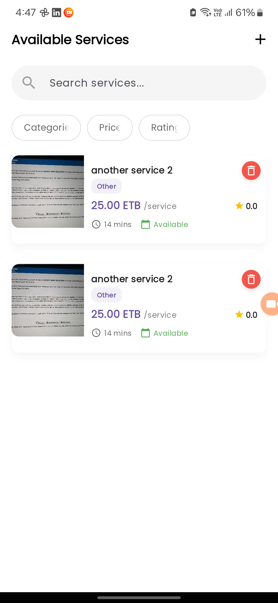
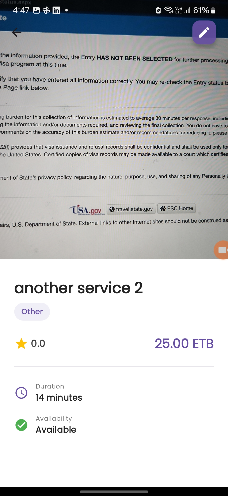
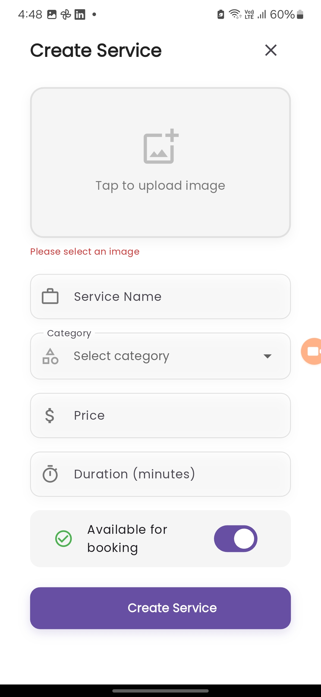
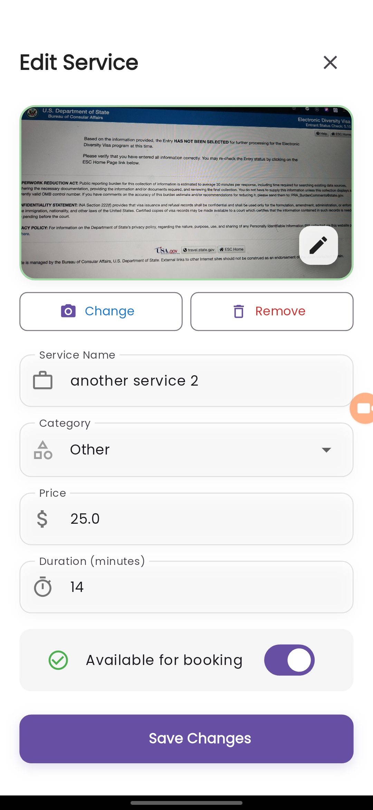
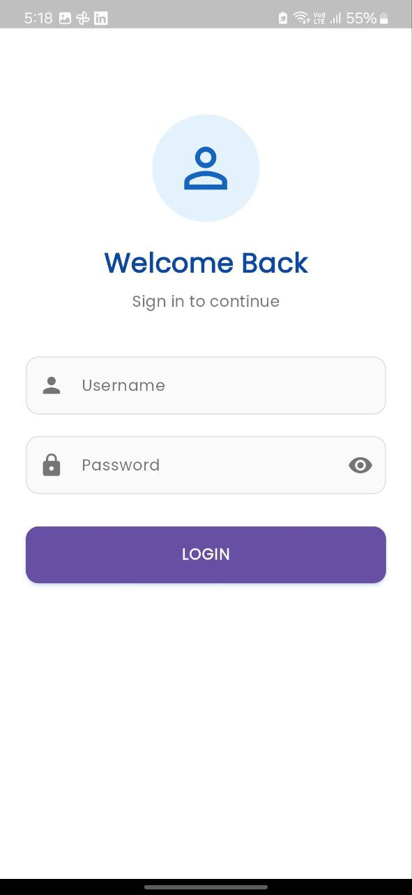
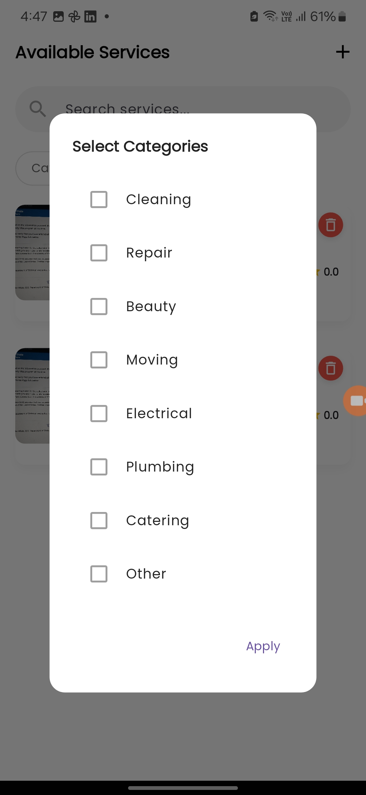
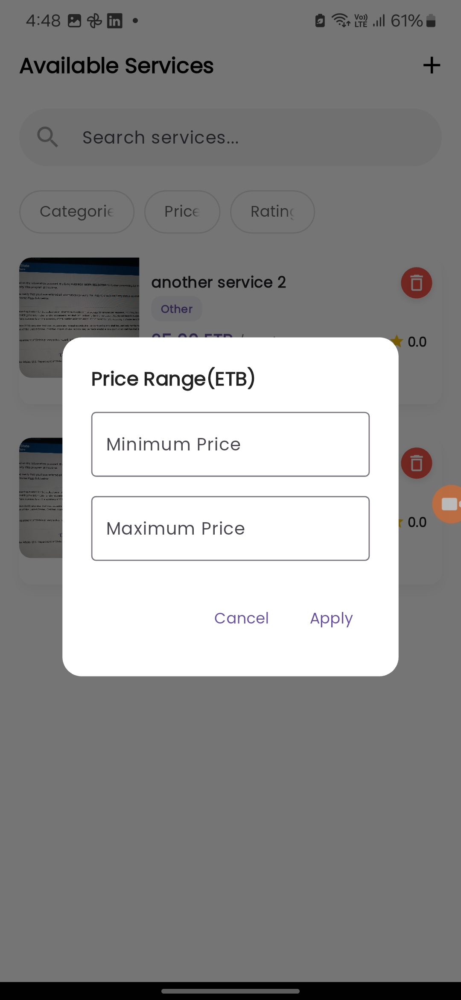

# Service Booking App (Flutter + GetX)

A Flutter application for managing services with full CRUD functionality, built using GetX for state management and following Clean Architecture principles.

## 📱 Screenshots

| Home Screen                              | Service Details                         | Add Service                              |
| ---------------------------------------- | --------------------------------------- | ---------------------------------------- |
|  |  |  |

| Edit Service                       | Search & Filter                     | Authentication                               |
| ---------------------------------- | ----------------------------------- | -------------------------------------------- |
|  |  |  |

| Category Filter                                  | Price Filter                               |
| ------------------------------------------------ | ------------------------------------------ |
|  |  |

## 🚀 Features

- **Full CRUD Operations**:

  - Create, Read, Update, and Delete services
  - Service model includes: name, category, price, image, availability, duration, rating

- **State Management**:

  - GetX for efficient state management
  - Dependency injection using GetX bindings

- **UI/UX**:

  - Clean, responsive design
  - Form validation with visual feedback
  - Loading indicators and toast notifications

- **Bonus Features**:
  - Search and filter services
  - Local persistence with Hive
  - Pagination for long lists
  - Hero animations
  - Authentication simulation

## 🏗️ Project Structure (Clean Architecture)

## Project Structure (Clean Architecture)

### lib/

### ├── core/

#### │ ├── constants/

#### │ ├── utils/

#### │ └── widgets/

### │

### ├── data/

#### │ ├── datasources/

#### │ ├── models/

#### │ └── repositories/

### │

### ├── domain/

#### │ ├── entities/

#### │ ├── repositories/

#### │ └── usecases/

### │

### └── presentation/

#### ├── bindings/

#### ├── controllers/

#### ├── middlewares/

#### └── pages/

## 🛠️ Setup Instructions

1. **Clone the repository**:

   ```bash
   git clone https://github.com/GadisaAboma/service-booking.git
   cd service-booking-app

   ```

2. **Get The dependecies**:

   ```bash
   flutter pub get
   ```

3. **Run the project**:

```bash
flutter run
```

## Implemented Features

Base Requirements
Full CRUD operations for services

GetX state management and routing

Clean Architecture implementation

Form validation and error handling

Responsive UI design

## Bonus Features

Search and filter functionality

Local persistence with Shared Preferences

Pagination implementation

Hero animations

Authentication simulation
